<div align="center"><a name="readme-top"></a>

# 🛒 抖音商城项目<br/><h3>基于 Spring Boot 的现代化电商平台后端系统</h3>

一个功能完整的电商平台后端系统，集成了用户管理、商品管理、购物车、订单处理和 AI 智能客服等核心功能。<br/>
支持前后端分离架构，可扩展的微服务设计，以及企业级的安全认证机制。<br/>
一键**免费**部署您的电商平台后端服务。

[在线演示][demo-link] · [更新日志][changelog] · [开发文档][docs] · [问题反馈][github-issues-link] · [📖 English](README_EN.md)

<br/>

[][project-link]

<br/>

<!-- SHIELD GROUP -->

[![][github-release-shield]][github-release-link]
[![][docker-release-shield]][docker-release-link]
[![][github-action-test-shield]][github-action-test-link]
[![][codecov-shield]][codecov-link]<br/>
[![][github-contributors-shield]][github-contributors-link]
[![][github-forks-shield]][github-forks-link]
[![][github-stars-shield]][github-stars-link]
[![][github-issues-shield]][github-issues-link]
[![][github-license-shield]][github-license-link]<br>

**分享项目仓库**

[![][share-x-shield]][share-x-link]
[![][share-telegram-shield]][share-telegram-link]
[![][share-whatsapp-shield]][share-whatsapp-link]
[![][share-reddit-shield]][share-reddit-link]
[![][share-weibo-shield]][share-weibo-link]
[![][share-linkedin-shield]][share-linkedin-link]

<sup>🌟 重生之我在青训营敲代码团队出品。为下一代电商平台而构建。</sup>

</div>

> [!IMPORTANT]
> 本项目是由"重生之我在青训营敲代码"团队（队伍编号：115）开发的完整电商平台后端系统。集成了最新的技术栈和企业级开发实践。

## 📸 项目展示

> [!TIP]
> 展示项目的核心功能界面和主要特性

<div align="center">
  
  <p><em>核心功能概览 - 用户管理、商品管理、订单处理</em></p>
</div>

<div align="center">
  
  
  <p><em>核心模块 - 用户管理和商品管理</em></p>
</div>

<details>
<summary><kbd>📱 更多功能展示</kbd></summary>

<div align="center">
  
  <p><em>购物车管理功能</em></p>
</div>

<div align="center">
  
  <p><em>AI 智能客服和订单处理</em></p>
</div>

</details>

**技术栈徽章:**

<div align="center">

 
 
 
 
 
 
 

</div>

</div>

> [!IMPORTANT]
> 本项目展示了现代 Spring Boot 开发实践，结合了 MySQL、Redis、阿里云服务等技术栈。它提供了完整的电商业务流程，包括用户认证、商品管理、购物车、订单处理和 AI 智能客服等功能。

<details>
<summary><kbd>📑 目录</kbd></summary>

#### 目录

- [🛒 抖音商城项目](#-抖音商城项目)
  - [📸 项目展示](#-项目展示)
  - [🌟 项目介绍](#-项目介绍)
  - [✨ 核心功能](#-核心功能)
  - [🛠️ 技术栈](#️-技术栈)
  - [🏗️ 系统架构](#️-系统架构)
  - [⚡️ 性能表现](#️-性能表现)
  - [🚀 快速开始](#-快速开始)
  - [🛳 部署指南](#-部署指南)
  - [📖 使用指南](#-使用指南)
  - [🔌 集成服务](#-集成服务)
  - [⌨️ 开发指南](#️-开发指南)
  - [🤝 贡献指南](#-贡献指南)
  - [👥 开发团队](#-开发团队)

####

<br/>

</details>

## 🌟 项目介绍

我们是充满激情的开发者团队，致力于创建下一代电商平台解决方案。通过采用现代化开发实践和前沿技术，我们旨在为用户和开发者提供强大、可扩展且用户友好的电商平台。

本项目是一个完整的电商平台后端系统，无论您是终端用户还是专业开发者，这个项目都将是您的电商开发实验场。请注意，该项目正在积极开发中，我们欢迎对遇到的任何[问题][issues-link]提供反馈。

> [!NOTE]
> - Java 8+ 是必需的
> - MySQL 8.0+ 数据库账户是必需的
> - Redis 6.0+ 用于缓存和会话存储
> - 阿里云账户（可选）用于 OSS 文件存储和短信服务

| [![][demo-shield-badge]][demo-link]   | 无需安装！访问我们的演示亲身体验。                           |
| :------------------------------------ | :----------------------------------------------------------- |
| [![][github-shield-badge]][github-link] | 加入我们的社区！与开发者和热心用户建立联系。 |

> [!TIP]
> **⭐ 给我们点星** 以便及时收到 GitHub 的所有发布通知！

## ✨ 核心功能

### `1` [用户管理系统][docs-feat-user]

完整的用户认证和权限管理系统。支持多种登录方式，包括密码登录和验证码登录，集成了 Sa-Token 权限框架提供企业级安全保障。

<div align="center">
  
  <p><em>用户管理系统核心功能</em></p>
</div>

核心能力包括:
- 🔐 **多重认证**: 支持密码登录、短信验证码、邮箱验证码
- 👥 **角色管理**: 用户和商家角色分离，权限精确控制
- 📱 **移动支持**: 支持手机号注册和短信验证
- 🛡️ **安全保护**: Sa-Token 框架提供 JWT 令牌安全认证

### `2` [商品管理系统][docs-feat-product]

先进的商品管理功能，支持图片上传、库存管理和商品状态控制。集成阿里云 OSS 存储，提供高可用的文件管理服务。

<div align="center">
  
  
  <p><em>商品管理系统 - 创建（左）和管理（右）</em></p>
</div>

**主要功能:**
- **商品创建**: 支持富文本描述、多图片上传和价格设置
- **库存管理**: 实时库存监控和自动库存扣减

### `3` [购物车系统][docs-feat-cart]

智能购物车管理，支持商品添加、删除和数量修改。Redis 缓存优化，提供快速响应的购物体验。

### `4` [订单处理系统][docs-feat-order]

完整的订单生命周期管理，从创建到支付完成。支持多种支付方式和订单状态跟踪。

### `5` [AI 智能客服][docs-feat-ai]

集成阿里云通义千问大模型，提供智能问答和自动订单处理功能。

### `*` 其他特性

除了核心功能外，本项目还包括：

- [x] 💨 **快速部署**: 一键启动，支持 Docker 容器化部署
- [x] 🌐 **多环境支持**: 开发、测试、生产环境配置分离
- [x] 🔒 **数据安全**: 所有数据加密存储，符合安全标准
- [x] 💎 **现代架构**: 微服务设计，易于扩展和维护
- [x] 🗣️ **实时处理**: 基于 Redis 的实时数据同步
- [x] 📊 **监控体系**: 完整的日志记录和性能监控
- [x] 🔌 **易扩展**: 模块化设计，支持自定义功能扩展
- [x] 📱 **API 优先**: RESTful API 设计，支持多端接入

> ✨ 更多功能正在持续开发中，敬请期待。

<div align="right">

[![][back-to-top]](#readme-top)

</div>

## 🛠️ 技术栈

<div align="center">
  <table>
    <tr>
      <td align="center" width="96">
        
        <br>Spring Boot 2.7
      </td>
      <td align="center" width="96">
        
        <br>Java 8
      </td>
      <td align="center" width="96">
        
        <br>MySQL 8.0
      </td>
      <td align="center" width="96">
        
        <br>Redis 6.0
      </td>
      <td align="center" width="96">
        
        <br>MyBatis
      </td>
      <td align="center" width="96">
        
        <br>阿里云服务
      </td>
      <td align="center" width="96">
        
        <br>Docker
      </td>
    </tr>
  </table>
</div>

**后端技术栈:**
- **核心框架**: Spring Boot 2.7.12 + Spring MVC
- **开发语言**: Java 8 提供稳定性和兼容性
- **数据存储**: MySQL 8.0 + HikariCP 连接池
- **缓存方案**: Redis 6.0 + Redisson 客户端
- **持久层**: MyBatis + MyBatis-Plus
- **安全框架**: Sa-Token 权限认证

**云服务集成:**
- **文件存储**: 阿里云 OSS 对象存储
- **短信服务**: 阿里云短信服务
- **AI 服务**: 阿里云通义千问大模型
- **监控告警**: 自定义日志监控系统

**开发和部署:**
- **项目构建**: Maven 3.6+
- **容器化**: Docker + Docker Compose
- **配置管理**: Spring Profiles 多环境配置
- **测试框架**: JUnit 5 + Mockito

> [!TIP]
> 每项技术都经过精心选择，确保生产就绪性、开发体验和长期可维护性。

## 🏗️ 系统架构

### 系统架构图

> [!TIP]
> 本架构支持水平扩展和微服务模式，适合企业级应用的生产环境。

```mermaid
graph TB
    subgraph "客户端层"
        A[Web 前端] --> B[移动端 App]
        B --> C[第三方集成]
    end
    
    subgraph "API 网关层"
        D[API Gateway] --> E[负载均衡]
        E --> F[安全认证]
    end
    
    subgraph "业务服务层"
        G[用户服务] --> H[商品服务]
        H --> I[订单服务]
        I --> J[支付服务]
        J --> K[AI 服务]
    end
    
    subgraph "数据存储层"
        L[MySQL 主库] --> M[MySQL 从库]
        N[Redis 缓存] --> O[文件存储 OSS]
    end
    
    A --> D
    F --> G
    G --> L
    H --> N
    
    subgraph "外部服务"
        P[阿里云 OSS]
        Q[阿里云短信]
        R[通义千问 AI]
        S[监控告警]
    end
    
    K --> R
    J --> Q
    H --> P
```



### 技术架构

```mermaid
graph LR
    subgraph "开发工具"
        D1[Java 8]
        D2[Maven]
        D3[Spring Boot]
        D4[MyBatis]
    end
    
    subgraph "核心服务"
        F1[用户管理]
        F2[商品管理]
        F3[订单处理]
        F4[AI 客服]
    end
    
    subgraph "数据层"
        B1[MySQL 8.0]
        B2[Redis 6.0]
        B3[阿里云 OSS]
        B4[连接池]
    end
    
    subgraph "部署运维"
        O1[Docker]
        O2[云服务器]
        O3[监控日志]
        O4[自动化测试]
    end
    
    D1 --> F1
    F1 --> B1
    B1 --> O1
```



### 数据流程

```mermaid
sequenceDiagram
    participant U as 用户
    participant F as 前端
    participant A as API 网关
    participant S as 业务服务
    participant D as 数据库
    participant C as Redis缓存
    participant E as 外部服务
    
    U->>F: 用户操作
    F->>A: HTTP 请求
    A->>A: 身份验证
    A->>S: 转发请求
    S->>C: 检查缓存
    alt 缓存命中
        C->>S: 返回缓存数据
    else 缓存未命中
        S->>D: 查询数据库
        D->>S: 返回数据
        S->>C: 更新缓存
    end
    S->>E: 调用外部服务
    E->>S: 返回结果
    S->>A: JSON 响应
    A->>F: 返回数据
    F->>U: 更新界面
```



### 数据库设计

<div align="center">
  
  <p><em>数据库实体关系图</em></p>
</div>

**核心数据表:**
- `users` - 用户信息表
- `products` - 商品信息表  
- `carts` - 购物车表
- `cart_items` - 购物车商品表
- `orders` - 订单表
- `order_items` - 订单商品表

## ⚡️ 性能表现

> [!NOTE]
> 完整的性能报告可在 [📘 性能文档][docs-performance] 中查看

### 性能监控面板

<div align="center">
  
  <p><em>实时性能监控面板</em></p>
</div>

### 性能指标

**关键指标:**
- ⚡ **API 响应时间** < 100ms（95% 请求）
- 🚀 **数据库查询** < 50ms 平均响应时间
- 💨 **缓存命中率** > 90% Redis 缓存
- 📊 **系统可用性** 99.9% 运行时间
- 🔄 **并发处理** 支持 1000+ 并发用户

**性能优化:**
- 🎯 **智能缓存**: Redis 多级缓存策略
- 📦 **连接池优化**: HikariCP 数据库连接池
- 🖼️ **文件优化**: 阿里云 OSS CDN 加速
- 🔄 **查询优化**: MyBatis 二级缓存和 SQL 优化

> [!NOTE]
> 性能指标通过专业工具持续监控，并在生产环境中验证。

## 🚀 快速开始

### 环境要求

> [!IMPORTANT]
> 确保您已安装以下环境:

- Java 8+ ([下载](https://www.oracle.com/java/technologies/downloads/))
- Maven 3.6+ ([下载](https://maven.apache.org/download.cgi))
- MySQL 8.0+ ([下载](https://dev.mysql.com/downloads/mysql/))
- Redis 6.0+ ([下载](https://redis.io/download/))
- Git ([下载](https://git-scm.com/))

### 快速安装

**1. 克隆仓库**

```bash
git clone https://github.com/ChanMeng666/douyin-mall.git
cd douyin-mall
```

**2. 配置数据库**

```bash
# 创建数据库
mysql -u root -p
CREATE DATABASE douyin_mall DEFAULT CHARACTER SET utf8mb4 COLLATE utf8mb4_general_ci;

# 导入数据表结构
mysql -u root -p douyin_mall < public/docs/数据库/douyin-mall-V1.1.0.sql

# 导入测试数据
mysql -u root -p douyin_mall < public/docs/数据库/250124_douyin_mall_data_injection.sql
```

**3. 配置应用**

```bash
# 复制配置文件模板
cp src/main/resources/application-dev.yml.example src/main/resources/application-dev.yml

# 编辑配置文件
nano src/main/resources/application-dev.yml
```

**4. 安装依赖并启动**

```bash
# 安装依赖
mvn clean install

# 启动应用
mvn spring-boot:run
```

🎉 **成功!** 打开 [http://localhost:8080](http://localhost:8080) 查看应用。

### 配置详解

创建 `application-dev.yml` 配置文件:

```yaml
# 数据库配置
spring:
  datasource:
    username: root
    password: your_password
    url: jdbc:mysql://localhost:3306/douyin_mall?useUnicode=true&characterEncoding=utf8
    driver-class-name: com.mysql.cj.jdbc.Driver

# Redis 配置
redis:
  sdk:
    config:
      host: localhost
      port: 6379
      pool-size: 10

# 阿里云服务配置（可选）
aliyun:
  oss:
    endpoint: your_endpoint
    accessKeyId: your_access_key
    accessKeySecret: your_secret_key
    bucketName: your_bucket

# AI 服务配置
dashscope:
  api-key: your_qwen_api_key
```

> [!TIP]
> 使用 `openssl rand -base64 32` 生成安全的随机密钥。

### 开发模式

```bash
# 启动开发服务器
mvn spring-boot:run -Dspring.profiles.active=dev

# 运行测试
mvn test

# 代码检查
mvn spotbugs:check

# 生产构建
mvn clean package -Dmaven.test.skip=true
```

## 🛳 部署指南

> [!IMPORTANT]
> 选择最适合您需求的部署策略。推荐云部署用于生产应用。

```mermaid
graph TB
    subgraph "本地开发"
        L1[mvn spring-boot:run]
        L2[localhost:8080]
    end
    
    subgraph "云部署"
        C1[阿里云 ECS]
        C2[腾讯云]
        C3[AWS EC2]
        C4[Railway]
    end
    
    subgraph "容器部署"
        D1[Docker]
        D2[Docker Compose]
        D3[Kubernetes]
    end
    
    L1 --> L2
    C1 --> |自动部署| C2
    D1 --> D2
    D2 --> D3
```



### `A` 云服务器部署

**阿里云 ECS 部署（推荐）**

```bash
# 1. 安装 Java 和 Maven
sudo yum install java-1.8.0-openjdk maven -y

# 2. 克隆项目
git clone https://github.com/ChanMeng666/douyin-mall.git
cd douyin-mall

# 3. 配置生产环境
cp src/main/resources/application-dev.yml src/main/resources/application-prod.yml
# 编辑 application-prod.yml 配置生产数据库和 Redis

# 4. 构建并部署
mvn clean package -Dmaven.test.skip=true
nohup java -jar -Dspring.profiles.active=prod target/douyin-mall-1.0-SNAPSHOT.jar > app.log 2>&1 &
```

### `B` Docker 部署

```bash
# 构建 Docker 镜像
docker build -t douyin-mall .

# 运行容器
docker run -p 8080:8080 \
  -e SPRING_PROFILES_ACTIVE=prod \
  -e MYSQL_HOST=your_mysql_host \
  -e REDIS_HOST=your_redis_host \
  douyin-mall
```

**docker-compose.yml:**

```yaml
version: '3.8'
services:
  app:
    build: .
    ports:
      - "8080:8080"
    environment:
      - SPRING_PROFILES_ACTIVE=prod
      - MYSQL_HOST=db
      - REDIS_HOST=redis
    depends_on:
      - db
      - redis
  
  db:
    image: mysql:8.0
    environment:
      MYSQL_DATABASE: douyin_mall
      MYSQL_ROOT_PASSWORD: password
    volumes:
      - mysql_data:/var/lib/mysql
      - ./public/docs/数据库/douyin-mall-V1.1.0.sql:/docker-entrypoint-initdb.d/init.sql

  redis:
    image: redis:6.0-alpine
    ports:
      - "6379:6379"

volumes:
  mysql_data:
```

### `C` 环境变量配置

> [!WARNING]
> 永远不要将敏感的环境变量提交到版本控制。在生产环境中使用安全的密钥管理。

| 变量名 | 描述 | 必需 | 默认值 | 示例 |
|--------|------|------|--------|------|
| `MYSQL_HOST` | MySQL 服务器地址 | ✅ | - | `localhost:3306` |
| `MYSQL_USERNAME` | MySQL 用户名 | ✅ | - | `root` |
| `MYSQL_PASSWORD` | MySQL 密码 | ✅ | - | `password123` |
| `REDIS_HOST` | Redis 服务器地址 | ✅ | - | `localhost:6379` |
| `ALIYUN_OSS_ENDPOINT` | 阿里云 OSS 端点 | 🔶 | - | `https://oss-cn-beijing.aliyuncs.com` |
| `QWEN_API_KEY` | 通义千问 API 密钥 | 🔶 | - | `sk-xxxxxxxxxxxxx` |

> [!NOTE]
> ✅ 必需，🔶 可选

## 📖 使用指南

### 基本使用

**开始使用:**

1. **用户注册/登录** 创建您的账户
2. **浏览商品** 查看可用商品列表
3. **添加购物车** 选择心仪商品
4. **下单支付** 完成购买流程

#### API 使用示例

**用户登录:**

```bash
curl -X POST http://localhost:8080/user/doLogin \
  -H "Content-Type: application/json" \
  -d '{
    "username": "testuser",
    "password": "password123"
  }'
```

**获取商品列表:**

```bash
curl -X GET http://localhost:8080/api/product/list \
  -H "Authorization: Bearer YOUR_TOKEN"
```

**添加商品到购物车:**

```bash
curl -X POST http://localhost:8080/api/cart/add \
  -H "Content-Type: application/json" \
  -H "Authorization: Bearer YOUR_TOKEN" \
  -d '{
    "userId": 1,
    "productId": 1,
    "quantity": 2
  }'
```

### API 文档

> [!TIP]
> 所有 API 端点支持 JSON 格式，需要适当的认证头。

**认证接口:**

| 方法 | 端点 | 描述 | 需要认证 |
|------|------|------|----------|
| `POST` | `/user/doLogin` | 用户登录 | ❌ |
| `POST` | `/user/LoginByCode` | 验证码登录 | ❌ |
| `POST` | `/user/USER/SignUp` | 用户注册 | ❌ |
| `POST` | `/user/doLogout` | 用户登出 | ✅ |

**商品接口:**

| 方法 | 端点 | 描述 | 需要认证 |
|------|------|------|----------|
| `GET` | `/api/product/list` | 获取商品列表 | ❌ |
| `POST` | `/api/product/create` | 创建商品 | ✅ |
| `GET` | `/api/product/get` | 获取商品详情 | ❌ |
| `PUT` | `/api/product/update` | 更新商品 | ✅ |
| `DELETE` | `/api/product/delete/{id}` | 删除商品 | ✅ |

**购物车接口:**

| 方法 | 端点 | 描述 | 需要认证 |
|------|------|------|----------|
| `POST` | `/api/cart/add` | 添加商品到购物车 | ✅ |
| `GET` | `/api/cart/user/{userId}` | 获取用户购物车 | ✅ |
| `DELETE` | `/api/cart/items/{itemId}` | 删除购物车商品 | ✅ |

**AI 服务接口:**

| 方法 | 端点 | 描述 | 需要认证 |
|------|------|------|----------|
| `POST` | `/api/ai/order/query` | AI 问答 | ✅ |
| `POST` | `/api/ai/order/auto` | AI 自动下单 | ✅ |

**示例响应:**

```json
{
  "code": "200",
  "info": "请求成功",
  "data": {
    "productId": 1,
    "name": "测试商品",
    "price": 99.99,
    "stock": 100,
    "imageUrl": "https://example.com/image.jpg"
  }
}
```

## 🔌 集成服务

我们支持与主流平台和服务的集成:

| 类别 | 服务 | 状态 | 文档链接 |
|------|------|------|----------|
| **文件存储** | 阿里云 OSS | ✅ 活跃 | [配置指南](docs/aliyun-oss.md) |
| **短信服务** | 阿里云短信 | ✅ 活跃 | [配置指南](docs/aliyun-sms.md) |
| **AI 服务** | 通义千问 | ✅ 活跃 | [配置指南](docs/qwen-ai.md) |
| **数据库** | MySQL 8.0 | ✅ 活跃 | [配置指南](docs/mysql.md) |
| **缓存** | Redis 6.0 | ✅ 活跃 | [配置指南](docs/redis.md) |
| **监控** | 自定义日志 | ✅ 活跃 | [配置指南](docs/logging.md) |

> 📊 总集成数: [<kbd>**6+**</kbd>](docs/integrations.md)

## ⌨️ 开发指南

### 本地开发

**设置开发环境:**

```bash
# 克隆仓库
git clone https://github.com/ChanMeng666/douyin-mall.git
cd douyin-mall

# 安装依赖
mvn clean install

# 设置数据库
# 参考快速开始部分的数据库配置

# 启动开发服务器
mvn spring-boot:run -Dspring.profiles.active=dev
```

**开发脚本:**

```bash
# 开发
mvn spring-boot:run          # 启动开发服务器
mvn compile                  # 编译项目
mvn spring-boot:run -Ddebug  # 调试模式启动

# 测试
mvn test                     # 运行单元测试
mvn test -Dtest=UserTest     # 运行指定测试
mvn jacoco:report           # 生成测试覆盖率报告

# 代码质量
mvn spotbugs:check          # 代码检查
mvn checkstyle:check        # 代码风格检查
mvn dependency:tree         # 依赖分析

# 构建
mvn clean package           # 生产构建
mvn clean install          # 安装到本地仓库
```

### 添加新功能

> [!TIP]
> 遵循我们的功能开发工作流程，确保代码库的一致性和质量。

```mermaid
flowchart TD
    A[创建 Issue] --> B[创建功能分支]
    B --> C[开发功能]
    C --> D[编写测试]
    D --> E[更新文档]
    E --> F[运行 CI/CD 检查]
    F --> G{所有检查通过?}
    G -->|否| C
    G -->|是| H[创建 Pull Request]
    H --> I[代码审查]
    I --> J{审查通过?}
    J -->|否| C
    J -->|是| K[合并到主分支]
    K --> L[部署到生产环境]
```



**1. 创建功能分支:**

```bash
git checkout -b feature/amazing-feature
```

**2. 功能结构:**

```
src/main/java/com/qxy/
├── controller/             # 控制器层
├── service/               # 服务层
├── dao/                   # 数据访问层
├── model/                 # 数据模型
├── config/                # 配置类
└── common/                # 公共组件
```

**3. 开发指南:**

- ✅ 遵循 Spring Boot 最佳实践
- ✅ 添加全面的单元测试
- ✅ 包含 Javadoc 文档
- ✅ 遵循 RESTful API 设计
- ✅ 添加适当的异常处理

### 测试

**单元测试:**

```java
@SpringBootTest
class ProductServiceTest {
    
    @Autowired
    private ProductService productService;
    
    @Test
    void testCreateProduct() {
        CreateProductDTO dto = new CreateProductDTO();
        dto.setName("测试商品");
        dto.setPrice(new BigDecimal("99.99"));
        
        Integer productId = productService.createProduct(dto, mockFile);
        assertThat(productId).isNotNull();
    }
}
```

## 🤝 贡献指南

我们欢迎贡献！以下是您可以帮助改进本项目的方式：

### 开发流程

**1. Fork & Clone:**

```bash
git clone https://github.com/ChanMeng666/douyin-mall.git
cd douyin-mall
```

**2. 创建分支:**

```bash
git checkout -b feature/your-feature-name
```

**3. 进行更改:**

- 遵循我们的[编码标准](CONTRIBUTING.md#coding-standards)
- 为新功能添加测试
- 根据需要更新文档
- 确保所有测试通过

**4. 提交 PR:**

- 提供清晰的描述
- 为 UI 更改包含截图
- 引用相关问题
- 确保 CI 通过

### 贡献指南

**代码风格:**
- 使用 Java 8 进行类型安全
- 遵循 Spring Boot 编码规范
- 编写有意义的提交消息
- 为公共 API 添加 Javadoc 注释

**问题报告:**
- 🐛 **Bug 报告**: 包含重现步骤
- 💡 **功能请求**: 解释用例和好处
- 📚 **文档**: 帮助改进我们的文档
- ❓ **问题**: 使用 GitHub Discussions

[![][pr-welcome-shield]][pr-welcome-link]

## 👥 开发团队

### 项目成员及分工

| **模块** | **功能** | **负责人** |
|---------|----------|------------|
| **架构设计与文档** | 数据库表设计，接入 AI 大模型，项目文档 | water |
| **认证中心** | 身份令牌的分发、续期和校验功能 | 苏泰宇 |
| **用户信息模块** | 注册、登录（验证码登录、密码登录）、用户信息管理 | 苏泰宇 |
| **商品信息模块** | 创建、删除、修改、查询、展示等 | 开发者5 |
| **购物车模块** | 创建、删除、添加、查询等 | ChanMeng666 |
| **订单模块** | 创建订单、取消订单、超时取消功能，订单状态管理 | 邓申桐 |
| **结算与支付** | 结算、支付和取消支付功能 | 魏鑫 |

### 作者信息

<div align="center">
  <table>
    <tr>
      <td align="center">
        <a href="https://github.com/ChanMeng666">
          
          <br />
          <sub><b>Chan Meng</b></sub>
        </a>
        <br />
        <small>项目负责人 & 购物车模块开发</small>
      </td>
    </tr>
  </table>
</div>

**联系方式:**
-  LinkedIn: [chanmeng666](https://www.linkedin.com/in/chanmeng666/)
-  GitHub: [ChanMeng666](https://github.com/ChanMeng666)
-  Email: [chanmeng.dev@gmail.com](mailto:chanmeng.dev@gmail.com)
-  Website: [chanmeng.live](https://2d-portfolio-eta.vercel.app/)

## 📄 开源协议

本项目采用 Apache-2.0 协议开源，详情请参阅 [LICENSE](LICENSE) 文件。

**开源优势:**
- ✅ 允许商业使用
- ✅ 允许修改
- ✅ 允许分发
- ✅ 允许私人使用

## 🔧 故障排除

<details>
<summary><kbd>🔧 常见问题</kbd></summary>

### 安装问题

**Java 版本冲突:**
```bash
# 检查 Java 版本
java -version

# 设置 Java 环境变量
export JAVA_HOME=/path/to/java8
```

**Maven 依赖失败:**
```bash
# 清理 Maven 缓存
mvn dependency:purge-local-repository

# 重新下载依赖
mvn clean install -U
```

### 开发问题

**端口已被占用:**
```bash
# 查找占用端口 8080 的进程
lsof -i :8080

# 终止进程
kill -9 <PID>
```

**数据库连接失败:**
- 验证数据库 URL 格式
- 检查网络连接性
- 确保数据库服务器正在运行
- 验证凭据和权限

</details>

---

<div align="center">
<strong>🚀 构建下一代电商平台 🌟</strong>
<br/>
<em>赋能全球开发者和用户</em>
<br/><br/>

⭐ **在 GitHub 上给我们点星** • 📖 **阅读文档** • 🐛 **报告问题** • 💡 **请求功能** • 🤝 **贡献代码**

<br/><br/>

**❤️ 由"重生之我在青训营敲代码"团队制作**


</div>

---

<!-- 链接定义 -->

[back-to-top]: https://img.shields.io/badge/-返回顶部-151515?style=flat-square

<!-- 项目链接 -->
[demo-link]: https://douyin-mall-demo.vercel.app
[changelog]: https://github.com/ChanMeng666/douyin-mall/releases
[docs]: https://douyin-mall-docs.vercel.app
[github-link]: https://github.com/ChanMeng666/douyin-mall

<!-- GitHub 链接 -->
[github-issues-link]: https://github.com/ChanMeng666/douyin-mall/issues
[github-stars-link]: https://github.com/ChanMeng666/douyin-mall/stargazers
[github-forks-link]: https://github.com/ChanMeng666/douyin-mall/forks
[github-contributors-link]: https://github.com/ChanMeng666/douyin-mall/contributors
[github-release-link]: https://github.com/ChanMeng666/douyin-mall/releases
[issues-link]: https://github.com/ChanMeng666/douyin-mall/issues
[pr-welcome-link]: https://github.com/ChanMeng666/douyin-mall/pulls

<!-- 文档链接 -->
[docs-feat-user]: https://douyin-mall-docs.vercel.app/features/user
[docs-feat-product]: https://douyin-mall-docs.vercel.app/features/product
[docs-feat-cart]: https://douyin-mall-docs.vercel.app/features/cart
[docs-feat-order]: https://douyin-mall-docs.vercel.app/features/order
[docs-feat-ai]: https://douyin-mall-docs.vercel.app/features/ai
[docs-performance]: https://douyin-mall-docs.vercel.app/performance

<!-- Shield 徽章 -->
[github-release-shield]: https://img.shields.io/github/v/release/ChanMeng666/douyin-mall?color=369eff&labelColor=black&logo=github&style=flat-square
[docker-release-shield]: https://img.shields.io/docker/v/chanmeng666/douyin-mall?color=369eff&labelColor=black&logo=docker&style=flat-square
[github-action-test-shield]: https://img.shields.io/github/actions/workflow/status/ChanMeng666/douyin-mall/test.yml?label=test&labelColor=black&logo=githubactions&logoColor=white&style=flat-square
[codecov-shield]: https://img.shields.io/codecov/c/github/ChanMeng666/douyin-mall?labelColor=black&style=flat-square&logo=codecov&logoColor=white
[github-contributors-shield]: https://img.shields.io/github/contributors/ChanMeng666/douyin-mall?color=c4f042&labelColor=black&style=flat-square
[github-forks-shield]: https://img.shields.io/github/forks/ChanMeng666/douyin-mall?color=8ae8ff&labelColor=black&style=flat-square
[github-stars-shield]: https://img.shields.io/github/stars/ChanMeng666/douyin-mall?color=ffcb47&labelColor=black&style=flat-square
[github-issues-shield]: https://img.shields.io/github/issues/ChanMeng666/douyin-mall?color=ff80eb&labelColor=black&style=flat-square
[github-license-shield]: https://img.shields.io/badge/license-Apache--2.0-white?labelColor=black&style=flat-square
[pr-welcome-shield]: https://img.shields.io/badge/🤝_PRs_welcome-%E2%86%92-ffcb47?labelColor=black&style=for-the-badge

<!-- 徽章变体 -->
[demo-shield-badge]: https://img.shields.io/badge/在线演示-ONLINE-55b467?labelColor=black&logo=vercel&style=for-the-badge
[github-shield-badge]: https://img.shields.io/badge/GitHub-Community-5865F2?labelColor=black&logo=github&logoColor=white&style=for-the-badge

<!-- 社交分享链接 -->
[share-x-link]: https://x.com/intent/tweet?hashtags=opensource,springboot,电商系统&text=查看这个amazing的抖音商城项目&url=https%3A%2F%2Fgithub.com%2FChanMeng666%2Fdouyin-mall
[share-telegram-link]: https://t.me/share/url?text=查看这个项目&url=https%3A%2F%2Fgithub.com%2FChanMeng666%2Fdouyin-mall
[share-whatsapp-link]: https://api.whatsapp.com/send?text=查看这个项目%20https%3A%2F%2Fgithub.com%2FChanMeng666%2Fdouyin-mall
[share-reddit-link]: https://www.reddit.com/submit?title=抖音商城项目&url=https%3A%2F%2Fgithub.com%2FChanMeng666%2Fdouyin-mall
[share-weibo-link]: http://service.weibo.com/share/share.php?title=查看这个项目&url=https%3A%2F%2Fgithub.com%2FChanMeng666%2Fdouyin-mall
[share-linkedin-link]: https://linkedin.com/sharing/share-offsite/?url=https://github.com/ChanMeng666/douyin-mall

[share-x-shield]: https://img.shields.io/badge/-share%20on%20x-black?labelColor=black&logo=x&logoColor=white&style=flat-square
[share-telegram-shield]: https://img.shields.io/badge/-share%20on%20telegram-black?labelColor=black&logo=telegram&logoColor=white&style=flat-square
[share-whatsapp-shield]: https://img.shields.io/badge/-share%20on%20whatsapp-black?labelColor=black&logo=whatsapp&logoColor=white&style=flat-square
[share-reddit-shield]: https://img.shields.io/badge/-share%20on%20reddit-black?labelColor=black&logo=reddit&logoColor=white&style=flat-square
[share-weibo-shield]: https://img.shields.io/badge/-share%20on%20weibo-black?labelColor=black&logo=sinaweibo&logoColor=white&style=flat-square
[share-linkedin-shield]: https://img.shields.io/badge/-share%20on%20linkedin-black?labelColor=black&logo=linkedin&logoColor=white&style=flat-square

