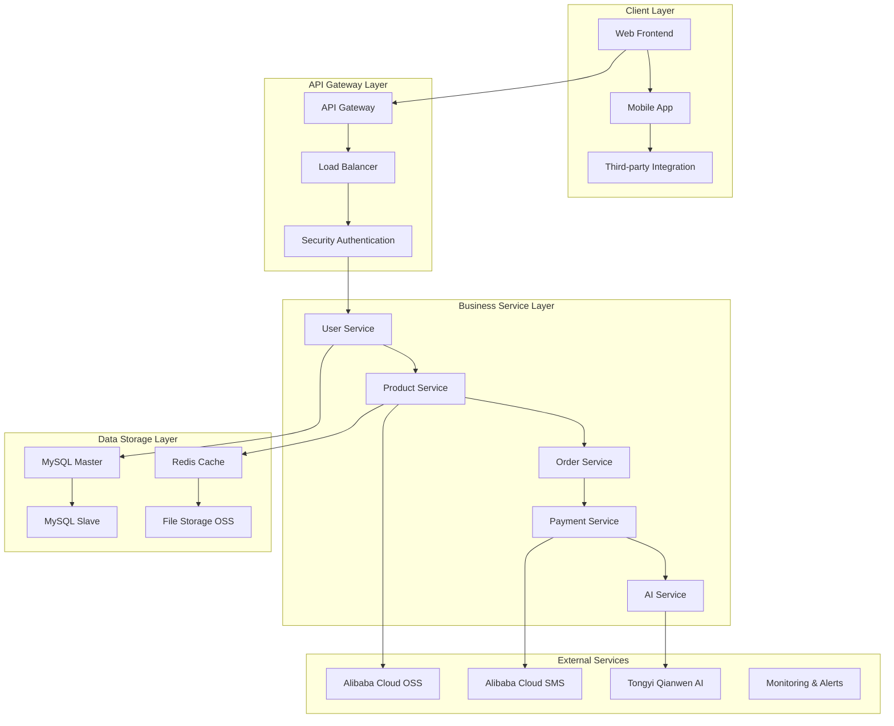
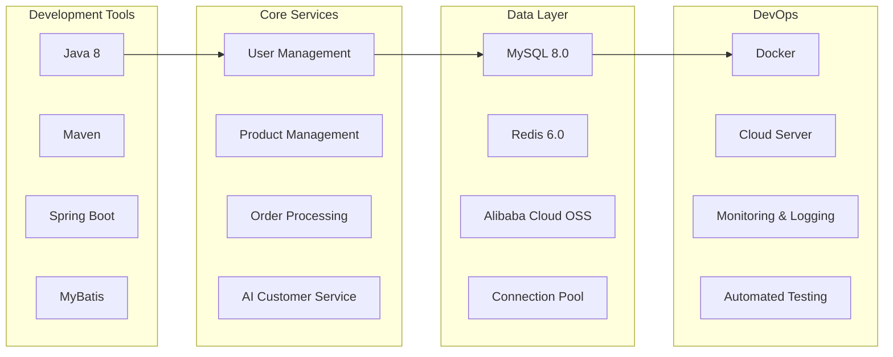
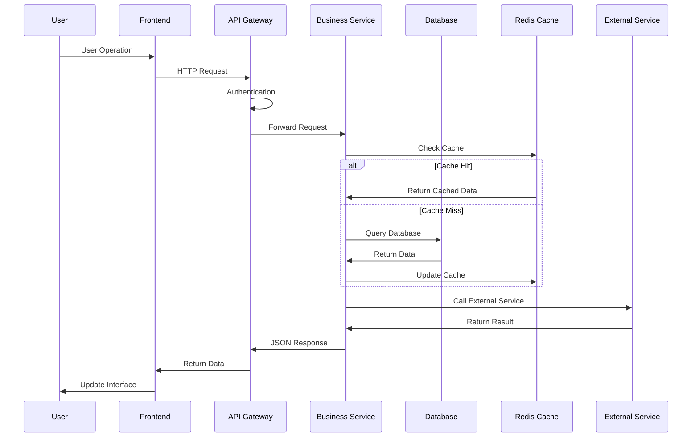
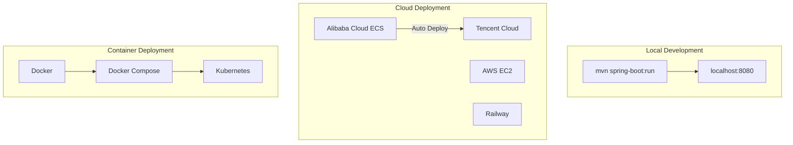
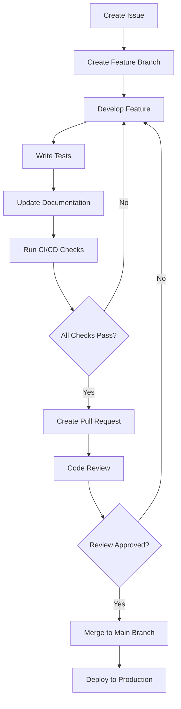

<div align="center"><a name="readme-top"></a>

# 🛒 Douyin Mall Project<br/><h3>Modern E-commerce Platform Backend System Based on Spring Boot</h3>

A feature-complete e-commerce platform backend system integrating user management, product management, shopping cart, order processing, and AI intelligent customer service.<br/>
Supports front-end and back-end separation architecture, scalable microservice design, and enterprise-grade security authentication mechanisms.<br/>
One-click **free** deployment of your e-commerce platform backend service.

[Live Demo][demo-link] · [Changelog][changelog] · [Documentation][docs] · [Issue Tracker][github-issues-link] · [🇨🇳 中文](README.md)

<br/>

[][project-link]

<br/>

<!-- SHIELD GROUP -->

[![][github-release-shield]][github-release-link]
[![][docker-release-shield]][docker-release-link]
[![][github-action-test-shield]][github-action-test-link]
[![][codecov-shield]][codecov-link]<br/>
[![][github-contributors-shield]][github-contributors-link]
[![][github-forks-shield]][github-forks-link]
[![][github-stars-shield]][github-stars-link]
[![][github-issues-shield]][github-issues-link]
[![][github-license-shield]][github-license-link]<br>

**Share this repository**

[![][share-x-shield]][share-x-link]
[![][share-telegram-shield]][share-telegram-link]
[![][share-whatsapp-shield]][share-whatsapp-link]
[![][share-reddit-shield]][share-reddit-link]
[![][share-weibo-shield]][share-weibo-link]
[![][share-linkedin-shield]][share-linkedin-link]

<sup>🌟 Created by "Rebirth: I Code at Youth Training Camp" Team. Built for the next generation of e-commerce platforms.</sup>

</div>

> [!IMPORTANT]
> This project is a complete e-commerce platform backend system developed by the "Rebirth: I Code at Youth Training Camp" team (Team ID: 115). It integrates the latest technology stack and enterprise-level development practices.

## 📸 Project Showcase

> [!TIP]
> Showcasing the core functional interfaces and main features of the project

<div align="center">
  
  <p><em>Core Features Overview - User Management, Product Management, Order Processing</em></p>
</div>

<div align="center">
  
  
  <p><em>Core Modules - User Management and Product Management</em></p>
</div>

<details>
<summary><kbd>📱 More Feature Showcase</kbd></summary>

<div align="center">
  
  <p><em>Shopping Cart Management Features</em></p>
</div>

<div align="center">
  
  <p><em>AI Intelligent Customer Service and Order Processing</em></p>
</div>

</details>

**Technology Stack Badges:**

<div align="center">

 
 
 
 
 
 
 

</div>

</div>

> [!IMPORTANT]
> This project demonstrates modern Spring Boot development practices, combining technologies like MySQL, Redis, Alibaba Cloud services, and more. It provides complete e-commerce business processes including user authentication, product management, shopping cart, order processing, and AI intelligent customer service.

<details>
<summary><kbd>📑 Table of Contents</kbd></summary>

#### Table of Contents

- [🛒 Douyin Mall Project](#-douyin-mall-project)
  - [📸 Project Showcase](#-project-showcase)
  - [🌟 Project Introduction](#-project-introduction)
  - [✨ Core Features](#-core-features)
  - [🛠️ Technology Stack](#️-technology-stack)
  - [🏗️ System Architecture](#️-system-architecture)
  - [⚡️ Performance Metrics](#️-performance-metrics)
  - [🚀 Quick Start](#-quick-start)
  - [🛳 Deployment Guide](#-deployment-guide)
  - [📖 Usage Guide](#-usage-guide)
  - [🔌 Service Integrations](#-service-integrations)
  - [⌨️ Development Guide](#️-development-guide)
  - [🤝 Contributing](#-contributing)
  - [👥 Development Team](#-development-team)

####

<br/>

</details>

## 🌟 Project Introduction

We are a passionate development team dedicated to creating next-generation e-commerce platform solutions. By adopting modern development practices and cutting-edge technologies, we aim to provide powerful, scalable, and user-friendly e-commerce platforms for both users and developers.

This project is a complete e-commerce platform backend system. Whether you are an end user or a professional developer, this project will serve as your e-commerce development playground. Please note that this project is under active development, and we welcome feedback on any [issues][issues-link] encountered.

> [!NOTE]
> - Java 8+ is required
> - MySQL 8.0+ database account is required
> - Redis 6.0+ for caching and session storage
> - Alibaba Cloud account (optional) for OSS file storage and SMS services

| [![][demo-shield-badge]][demo-link]   | No installation required! Visit our demo to experience it firsthand.                           |
| :------------------------------------ | :----------------------------------------------------------- |
| [![][github-shield-badge]][github-link] | Join our community! Connect with developers and enthusiastic users. |

> [!TIP]
> **⭐ Star us** to receive all release notifications from GitHub in a timely manner!

## ✨ Core Features

### `1` [User Management System][docs-feat-user]

Complete user authentication and permission management system. Supports multiple login methods including password login and verification code login, integrated with Sa-Token permission framework for enterprise-grade security.

<div align="center">
  
  <p><em>User Management System Core Features</em></p>
</div>

Core capabilities include:
- 🔐 **Multi-factor Authentication**: Supports password login, SMS verification, email verification
- 👥 **Role Management**: User and merchant role separation, precise permission control
- 📱 **Mobile Support**: Supports phone number registration and SMS verification
- 🛡️ **Security Protection**: Sa-Token framework provides JWT token security authentication

### `2` [Product Management System][docs-feat-product]

Advanced product management functionality supporting image upload, inventory management, and product status control. Integrated with Alibaba Cloud OSS storage for high-availability file management services.

<div align="center">
  
  
  <p><em>Product Management System - Creation (Left) and Management (Right)</em></p>
</div>

**Main Features:**
- **Product Creation**: Supports rich text descriptions, multi-image upload, and price setting
- **Inventory Management**: Real-time inventory monitoring and automatic inventory deduction

### `3` [Shopping Cart System][docs-feat-cart]

Intelligent shopping cart management supporting product addition, deletion, and quantity modification. Redis cache optimization provides fast-response shopping experience.

### `4` [Order Processing System][docs-feat-order]

Complete order lifecycle management from creation to payment completion. Supports multiple payment methods and order status tracking.

### `5` [AI Intelligent Customer Service][docs-feat-ai]

Integrated with Alibaba Cloud Tongyi Qianwen large model, providing intelligent Q&A and automatic order processing functionality.

### `*` Other Features

In addition to core features, this project also includes:

- [x] 💨 **Rapid Deployment**: One-click startup, supports Docker containerized deployment
- [x] 🌐 **Multi-environment Support**: Development, testing, production environment configuration separation
- [x] 🔒 **Data Security**: All data encrypted storage, compliant with security standards
- [x] 💎 **Modern Architecture**: Microservice design, easy to scale and maintain
- [x] 🗣️ **Real-time Processing**: Redis-based real-time data synchronization
- [x] 📊 **Monitoring System**: Complete logging and performance monitoring
- [x] 🔌 **Highly Extensible**: Modular design, supports custom feature extensions
- [x] 📱 **API First**: RESTful API design, supports multi-terminal access

> ✨ More features are continuously being developed, stay tuned.

<div align="right">

[![][back-to-top]](#readme-top)

</div>

## 🛠️ Technology Stack

<div align="center">
  <table>
    <tr>
      <td align="center" width="96">
        
        <br>Spring Boot 2.7
      </td>
      <td align="center" width="96">
        
        <br>Java 8
      </td>
      <td align="center" width="96">
        
        <br>MySQL 8.0
      </td>
      <td align="center" width="96">
        
        <br>Redis 6.0
      </td>
      <td align="center" width="96">
        
        <br>MyBatis
      </td>
      <td align="center" width="96">
        
        <br>Alibaba Cloud
      </td>
      <td align="center" width="96">
        
        <br>Docker
      </td>
    </tr>
  </table>
</div>

**Backend Technology Stack:**
- **Core Framework**: Spring Boot 2.7.12 + Spring MVC
- **Development Language**: Java 8 for stability and compatibility
- **Data Storage**: MySQL 8.0 + HikariCP connection pool
- **Caching Solution**: Redis 6.0 + Redisson client
- **Persistence Layer**: MyBatis + MyBatis-Plus
- **Security Framework**: Sa-Token permission authentication

**Cloud Service Integration:**
- **File Storage**: Alibaba Cloud OSS object storage
- **SMS Service**: Alibaba Cloud SMS service
- **AI Service**: Alibaba Cloud Tongyi Qianwen large model
- **Monitoring & Alerting**: Custom logging monitoring system

**Development and Deployment:**
- **Project Build**: Maven 3.6+
- **Containerization**: Docker + Docker Compose
- **Configuration Management**: Spring Profiles multi-environment configuration
- **Testing Framework**: JUnit 5 + Mockito

> [!TIP]
> Each technology has been carefully selected to ensure production readiness, development experience, and long-term maintainability.

## 🏗️ System Architecture

### System Architecture Diagram

> [!TIP]
> This architecture supports horizontal scaling and microservice patterns, suitable for enterprise-level application production environments.



### Technical Architecture



### Data Flow



### Database Design

<div align="center">
  
  <p><em>Database Entity Relationship Diagram</em></p>
</div>

**Core Data Tables:**
- `users` - User information table
- `products` - Product information table  
- `carts` - Shopping cart table
- `cart_items` - Shopping cart items table
- `orders` - Order table
- `order_items` - Order items table

## ⚡️ Performance Metrics

> [!NOTE]
> Complete performance reports can be viewed in [📘 Performance Documentation][docs-performance]

### Performance Monitoring Dashboard

<div align="center">
  
  <p><em>Real-time Performance Monitoring Dashboard</em></p>
</div>

### Performance Indicators

**Key Metrics:**
- ⚡ **API Response Time** < 100ms (95% of requests)
- 🚀 **Database Queries** < 50ms average response time
- 💨 **Cache Hit Rate** > 90% Redis cache
- 📊 **System Availability** 99.9% uptime
- 🔄 **Concurrent Processing** Supports 1000+ concurrent users

**Performance Optimizations:**
- 🎯 **Smart Caching**: Redis multi-level caching strategy
- 📦 **Connection Pool Optimization**: HikariCP database connection pool
- 🖼️ **File Optimization**: Alibaba Cloud OSS CDN acceleration
- 🔄 **Query Optimization**: MyBatis second-level cache and SQL optimization

> [!NOTE]
> Performance metrics are continuously monitored through professional tools and validated in production environments.

## 🚀 Quick Start

### Prerequisites

> [!IMPORTANT]
> Ensure you have the following environment installed:

- Java 8+ ([Download](https://www.oracle.com/java/technologies/downloads/))
- Maven 3.6+ ([Download](https://maven.apache.org/download.cgi))
- MySQL 8.0+ ([Download](https://dev.mysql.com/downloads/mysql/))
- Redis 6.0+ ([Download](https://redis.io/download/))
- Git ([Download](https://git-scm.com/))

### Quick Installation

**1. Clone Repository**

```bash
git clone https://github.com/ChanMeng666/douyin-mall.git
cd douyin-mall
```

**2. Configure Database**

```bash
# Create database
mysql -u root -p
CREATE DATABASE douyin_mall DEFAULT CHARACTER SET utf8mb4 COLLATE utf8mb4_general_ci;

# Import database schema
mysql -u root -p douyin_mall < public/docs/数据库/douyin-mall-V1.1.0.sql

# Import test data
mysql -u root -p douyin_mall < public/docs/数据库/250124_douyin_mall_data_injection.sql
```

**3. Configure Application**

```bash
# Copy configuration template
cp src/main/resources/application-dev.yml.example src/main/resources/application-dev.yml

# Edit configuration file
nano src/main/resources/application-dev.yml
```

**4. Install Dependencies and Start**

```bash
# Install dependencies
mvn clean install

# Start application
mvn spring-boot:run
```

🎉 **Success!** Open [http://localhost:8080](http://localhost:8080) to view the application.

### Configuration Details

Create `application-dev.yml` configuration file:

```yaml
# Database configuration
spring:
  datasource:
    username: root
    password: your_password
    url: jdbc:mysql://localhost:3306/douyin_mall?useUnicode=true&characterEncoding=utf8
    driver-class-name: com.mysql.cj.jdbc.Driver

# Redis configuration
redis:
  sdk:
    config:
      host: localhost
      port: 6379
      pool-size: 10

# Alibaba Cloud service configuration (optional)
aliyun:
  oss:
    endpoint: your_endpoint
    accessKeyId: your_access_key
    accessKeySecret: your_secret_key
    bucketName: your_bucket

# AI service configuration
dashscope:
  api-key: your_qwen_api_key
```

> [!TIP]
> Use `openssl rand -base64 32` to generate secure random keys.

### Development Mode

```bash
# Start development server
mvn spring-boot:run -Dspring.profiles.active=dev

# Run tests
mvn test

# Code inspection
mvn spotbugs:check

# Production build
mvn clean package -Dmaven.test.skip=true
```

## 🛳 Deployment Guide

> [!IMPORTANT]
> Choose the deployment strategy that best fits your needs. Cloud deployment is recommended for production applications.



### `A` Cloud Server Deployment

**Alibaba Cloud ECS Deployment (Recommended)**

```bash
# 1. Install Java and Maven
sudo yum install java-1.8.0-openjdk maven -y

# 2. Clone project
git clone https://github.com/ChanMeng666/douyin-mall.git
cd douyin-mall

# 3. Configure production environment
cp src/main/resources/application-dev.yml src/main/resources/application-prod.yml
# Edit application-prod.yml to configure production database and Redis

# 4. Build and deploy
mvn clean package -Dmaven.test.skip=true
nohup java -jar -Dspring.profiles.active=prod target/douyin-mall-1.0-SNAPSHOT.jar > app.log 2>&1 &
```

### `B` Docker Deployment

```bash
# Build Docker image
docker build -t douyin-mall .

# Run container
docker run -p 8080:8080 \
  -e SPRING_PROFILES_ACTIVE=prod \
  -e MYSQL_HOST=your_mysql_host \
  -e REDIS_HOST=your_redis_host \
  douyin-mall
```

**docker-compose.yml:**

```yaml
version: '3.8'
services:
  app:
    build: .
    ports:
      - "8080:8080"
    environment:
      - SPRING_PROFILES_ACTIVE=prod
      - MYSQL_HOST=db
      - REDIS_HOST=redis
    depends_on:
      - db
      - redis
  
  db:
    image: mysql:8.0
    environment:
      MYSQL_DATABASE: douyin_mall
      MYSQL_ROOT_PASSWORD: password
    volumes:
      - mysql_data:/var/lib/mysql
      - ./public/docs/数据库/douyin-mall-V1.1.0.sql:/docker-entrypoint-initdb.d/init.sql

  redis:
    image: redis:6.0-alpine
    ports:
      - "6379:6379"

volumes:
  mysql_data:
```

### `C` Environment Variables Configuration

> [!WARNING]
> Never commit sensitive environment variables to version control. Use secure key management in production environments.

| Variable | Description | Required | Default | Example |
|----------|-------------|----------|---------|---------|
| `MYSQL_HOST` | MySQL server address | ✅ | - | `localhost:3306` |
| `MYSQL_USERNAME` | MySQL username | ✅ | - | `root` |
| `MYSQL_PASSWORD` | MySQL password | ✅ | - | `password123` |
| `REDIS_HOST` | Redis server address | ✅ | - | `localhost:6379` |
| `ALIYUN_OSS_ENDPOINT` | Alibaba Cloud OSS endpoint | 🔶 | - | `https://oss-cn-beijing.aliyuncs.com` |
| `QWEN_API_KEY` | Tongyi Qianwen API key | 🔶 | - | `sk-xxxxxxxxxxxxx` |

> [!NOTE]
> ✅ Required, 🔶 Optional

## 📖 Usage Guide

### Basic Usage

**Getting Started:**

1. **User Registration/Login** Create your account
2. **Browse Products** View available product listings
3. **Add to Cart** Select desired products
4. **Place Order** Complete the purchase process

#### API Usage Examples

**User Login:**

```bash
curl -X POST http://localhost:8080/user/doLogin \
  -H "Content-Type: application/json" \
  -d '{
    "username": "testuser",
    "password": "password123"
  }'
```

**Get Product List:**

```bash
curl -X GET http://localhost:8080/api/product/list \
  -H "Authorization: Bearer YOUR_TOKEN"
```

**Add Product to Cart:**

```bash
curl -X POST http://localhost:8080/api/cart/add \
  -H "Content-Type: application/json" \
  -H "Authorization: Bearer YOUR_TOKEN" \
  -d '{
    "userId": 1,
    "productId": 1,
    "quantity": 2
  }'
```

### API Documentation

> [!TIP]
> All API endpoints support JSON format and require appropriate authentication headers.

**Authentication Endpoints:**

| Method | Endpoint | Description | Auth Required |
|--------|----------|-------------|---------------|
| `POST` | `/user/doLogin` | User login | ❌ |
| `POST` | `/user/LoginByCode` | Login with verification code | ❌ |
| `POST` | `/user/USER/SignUp` | User registration | ❌ |
| `POST` | `/user/doLogout` | User logout | ✅ |

**Product Endpoints:**

| Method | Endpoint | Description | Auth Required |
|--------|----------|-------------|---------------|
| `GET` | `/api/product/list` | Get product list | ❌ |
| `POST` | `/api/product/create` | Create product | ✅ |
| `GET` | `/api/product/get` | Get product details | ❌ |
| `PUT` | `/api/product/update` | Update product | ✅ |
| `DELETE` | `/api/product/delete/{id}` | Delete product | ✅ |

**Shopping Cart Endpoints:**

| Method | Endpoint | Description | Auth Required |
|--------|----------|-------------|---------------|
| `POST` | `/api/cart/add` | Add product to cart | ✅ |
| `GET` | `/api/cart/user/{userId}` | Get user's cart | ✅ |
| `DELETE` | `/api/cart/items/{itemId}` | Delete cart item | ✅ |

**AI Service Endpoints:**

| Method | Endpoint | Description | Auth Required |
|--------|----------|-------------|---------------|
| `POST` | `/api/ai/order/query` | AI Q&A | ✅ |
| `POST` | `/api/ai/order/auto` | AI auto order | ✅ |

**Example Response:**

```json
{
  "code": "200",
  "info": "Request successful",
  "data": {
    "productId": 1,
    "name": "Test Product",
    "price": 99.99,
    "stock": 100,
    "imageUrl": "https://example.com/image.jpg"
  }
}
```

## 🔌 Service Integrations

We support integration with mainstream platforms and services:

| Category | Service | Status | Documentation |
|----------|---------|--------|---------------|
| **File Storage** | Alibaba Cloud OSS | ✅ Active | [Configuration Guide](docs/aliyun-oss.md) |
| **SMS Service** | Alibaba Cloud SMS | ✅ Active | [Configuration Guide](docs/aliyun-sms.md) |
| **AI Service** | Tongyi Qianwen | ✅ Active | [Configuration Guide](docs/qwen-ai.md) |
| **Database** | MySQL 8.0 | ✅ Active | [Configuration Guide](docs/mysql.md) |
| **Cache** | Redis 6.0 | ✅ Active | [Configuration Guide](docs/redis.md) |
| **Monitoring** | Custom Logging | ✅ Active | [Configuration Guide](docs/logging.md) |

> 📊 Total Integrations: [<kbd>**6+**</kbd>](docs/integrations.md)

## ⌨️ Development Guide

### Local Development

**Setting up Development Environment:**

```bash
# Clone repository
git clone https://github.com/ChanMeng666/douyin-mall.git
cd douyin-mall

# Install dependencies
mvn clean install

# Setup database
# Refer to the database configuration in Quick Start section

# Start development server
mvn spring-boot:run -Dspring.profiles.active=dev
```

**Development Scripts:**

```bash
# Development
mvn spring-boot:run          # Start development server
mvn compile                  # Compile project
mvn spring-boot:run -Ddebug  # Start in debug mode

# Testing
mvn test                     # Run unit tests
mvn test -Dtest=UserTest     # Run specific test
mvn jacoco:report           # Generate test coverage report

# Code Quality
mvn spotbugs:check          # Code inspection
mvn checkstyle:check        # Code style check
mvn dependency:tree         # Dependency analysis

# Build
mvn clean package           # Production build
mvn clean install          # Install to local repository
```

### Adding New Features

> [!TIP]
> Follow our feature development workflow to ensure codebase consistency and quality.



**1. Create Feature Branch:**

```bash
git checkout -b feature/amazing-feature
```

**2. Feature Structure:**

```
src/main/java/com/qxy/
├── controller/             # Controller layer
├── service/               # Service layer
├── dao/                   # Data access layer
├── model/                 # Data models
├── config/                # Configuration classes
└── common/                # Common components
```

**3. Development Guidelines:**

- ✅ Follow Spring Boot best practices
- ✅ Add comprehensive unit tests
- ✅ Include Javadoc documentation
- ✅ Follow RESTful API design
- ✅ Add appropriate exception handling

### Testing

**Unit Testing:**

```java
@SpringBootTest
class ProductServiceTest {
    
    @Autowired
    private ProductService productService;
    
    @Test
    void testCreateProduct() {
        CreateProductDTO dto = new CreateProductDTO();
        dto.setName("Test Product");
        dto.setPrice(new BigDecimal("99.99"));
        
        Integer productId = productService.createProduct(dto, mockFile);
        assertThat(productId).isNotNull();
    }
}
```

## 🤝 Contributing

We welcome contributions! Here's how you can help improve this project:

### Development Workflow

**1. Fork & Clone:**

```bash
git clone https://github.com/ChanMeng666/douyin-mall.git
cd douyin-mall
```

**2. Create Branch:**

```bash
git checkout -b feature/your-feature-name
```

**3. Make Changes:**

- Follow our [coding standards](CONTRIBUTING.md#coding-standards)
- Add tests for new features
- Update documentation as needed
- Ensure all tests pass

**4. Submit PR:**

- Provide clear description
- Include screenshots for UI changes
- Reference related issues
- Ensure CI passes

### Contribution Guidelines

**Code Style:**
- Use Java 8 for type safety
- Follow Spring Boot coding conventions
- Write meaningful commit messages
- Add Javadoc comments for public APIs

**Issue Reporting:**
- 🐛 **Bug Reports**: Include reproduction steps
- 💡 **Feature Requests**: Explain use cases and benefits
- 📚 **Documentation**: Help improve our documentation
- ❓ **Questions**: Use GitHub Discussions

[![][pr-welcome-shield]][pr-welcome-link]

## 👥 Development Team

### Project Members and Responsibilities

| **Module** | **Function** | **Responsible Person** |
|-----------|--------------|------------------------|
| **Architecture Design & Documentation** | Database table design, AI model integration, project documentation | water |
| **Authentication Center** | Token distribution, renewal, and validation | Su Taiyu |
| **User Information Module** | Registration, login (verification code login, password login), user info management | Su Taiyu |
| **Product Information Module** | Create, delete, modify, query, display, etc. | Developer5 |
| **Shopping Cart Module** | Create, delete, add, query, etc. | ChanMeng666 |
| **Order Module** | Create orders, cancel orders, timeout cancellation, order status management | Deng Shentong |
| **Settlement & Payment** | Settlement, payment, and payment cancellation | Wei Xin |

### Author Information

<div align="center">
  <table>
    <tr>
      <td align="center">
        <a href="https://github.com/ChanMeng666">
          
          <br />
          <sub><b>Chan Meng</b></sub>
        </a>
        <br />
        <small>Project Lead & Shopping Cart Module Developer</small>
      </td>
    </tr>
  </table>
</div>

**Contact Information:**
-  LinkedIn: [chanmeng666](https://www.linkedin.com/in/chanmeng666/)
-  GitHub: [ChanMeng666](https://github.com/ChanMeng666)
-  Email: [chanmeng.dev@gmail.com](mailto:chanmeng.dev@gmail.com)
-  Website: [chanmeng.live](https://2d-portfolio-eta.vercel.app/)

## 📄 License

This project is licensed under the Apache-2.0 License. See the [LICENSE](LICENSE) file for details.

**Open Source Benefits:**
- ✅ Commercial use allowed
- ✅ Modification allowed
- ✅ Distribution allowed
- ✅ Private use allowed

## 🔧 Troubleshooting

<details>
<summary><kbd>🔧 Common Issues</kbd></summary>

### Installation Issues

**Java Version Conflicts:**
```bash
# Check Java version
java -version

# Set Java environment variable
export JAVA_HOME=/path/to/java8
```

**Maven Dependency Failures:**
```bash
# Clean Maven cache
mvn dependency:purge-local-repository

# Re-download dependencies
mvn clean install -U
```

### Development Issues

**Port Already in Use:**
```bash
# Find process using port 8080
lsof -i :8080

# Kill process
kill -9 <PID>
```

**Database Connection Failed:**
- Verify database URL format
- Check network connectivity
- Ensure database server is running
- Verify credentials and permissions

</details>

---

<div align="center">
<strong>🚀 Building the Next Generation E-commerce Platform 🌟</strong>
<br/>
<em>Empowering developers and users worldwide</em>
<br/><br/>

⭐ **Star us on GitHub** • 📖 **Read the docs** • 🐛 **Report issues** • 💡 **Request features** • 🤝 **Contribute code**

<br/><br/>

**❤️ Made with passion by "Rebirth: I Code at Youth Training Camp" Team**


</div>

---

<!-- Link Definitions -->

[back-to-top]: https://img.shields.io/badge/-Back%20to%20Top-151515?style=flat-square

<!-- Project Links -->
[demo-link]: https://douyin-mall-demo.vercel.app
[changelog]: https://github.com/ChanMeng666/douyin-mall/releases
[docs]: https://douyin-mall-docs.vercel.app
[github-link]: https://github.com/ChanMeng666/douyin-mall

<!-- GitHub Links -->
[github-issues-link]: https://github.com/ChanMeng666/douyin-mall/issues
[github-stars-link]: https://github.com/ChanMeng666/douyin-mall/stargazers
[github-forks-link]: https://github.com/ChanMeng666/douyin-mall/forks
[github-contributors-link]: https://github.com/ChanMeng666/douyin-mall/contributors
[github-release-link]: https://github.com/ChanMeng666/douyin-mall/releases
[issues-link]: https://github.com/ChanMeng666/douyin-mall/issues
[pr-welcome-link]: https://github.com/ChanMeng666/douyin-mall/pulls

<!-- Documentation Links -->
[docs-feat-user]: https://douyin-mall-docs.vercel.app/features/user
[docs-feat-product]: https://douyin-mall-docs.vercel.app/features/product
[docs-feat-cart]: https://douyin-mall-docs.vercel.app/features/cart
[docs-feat-order]: https://douyin-mall-docs.vercel.app/features/order
[docs-feat-ai]: https://douyin-mall-docs.vercel.app/features/ai
[docs-performance]: https://douyin-mall-docs.vercel.app/performance

<!-- Shield Badges -->
[github-release-shield]: https://img.shields.io/github/v/release/ChanMeng666/douyin-mall?color=369eff&labelColor=black&logo=github&style=flat-square
[docker-release-shield]: https://img.shields.io/docker/v/chanmeng666/douyin-mall?color=369eff&labelColor=black&logo=docker&style=flat-square
[github-action-test-shield]: https://img.shields.io/github/actions/workflow/status/ChanMeng666/douyin-mall/test.yml?label=test&labelColor=black&logo=githubactions&logoColor=white&style=flat-square
[codecov-shield]: https://img.shields.io/codecov/c/github/ChanMeng666/douyin-mall?labelColor=black&style=flat-square&logo=codecov&logoColor=white
[github-contributors-shield]: https://img.shields.io/github/contributors/ChanMeng666/douyin-mall?color=c4f042&labelColor=black&style=flat-square
[github-forks-shield]: https://img.shields.io/github/forks/ChanMeng666/douyin-mall?color=8ae8ff&labelColor=black&style=flat-square
[github-stars-shield]: https://img.shields.io/github/stars/ChanMeng666/douyin-mall?color=ffcb47&labelColor=black&style=flat-square
[github-issues-shield]: https://img.shields.io/github/issues/ChanMeng666/douyin-mall?color=ff80eb&labelColor=black&style=flat-square
[github-license-shield]: https://img.shields.io/badge/license-Apache--2.0-white?labelColor=black&style=flat-square
[pr-welcome-shield]: https://img.shields.io/badge/🤝_PRs_welcome-%E2%86%92-ffcb47?labelColor=black&style=for-the-badge

<!-- Badge Variants -->
[demo-shield-badge]: https://img.shields.io/badge/Live%20Demo-ONLINE-55b467?labelColor=black&logo=vercel&style=for-the-badge
[github-shield-badge]: https://img.shields.io/badge/GitHub-Community-5865F2?labelColor=black&logo=github&logoColor=white&style=for-the-badge

<!-- Social Share Links -->
[share-x-link]: https://x.com/intent/tweet?hashtags=opensource,springboot,ecommerce&text=Check%20out%20this%20amazing%20Douyin%20Mall%20project&url=https%3A%2F%2Fgithub.com%2FChanMeng666%2Fdouyin-mall
[share-telegram-link]: https://t.me/share/url?text=Check%20out%20this%20project&url=https%3A%2F%2Fgithub.com%2FChanMeng666%2Fdouyin-mall
[share-whatsapp-link]: https://api.whatsapp.com/send?text=Check%20out%20this%20project%20https%3A%2F%2Fgithub.com%2FChanMeng666%2Fdouyin-mall
[share-reddit-link]: https://www.reddit.com/submit?title=Douyin%20Mall%20Project&url=https%3A%2F%2Fgithub.com%2FChanMeng666%2Fdouyin-mall
[share-weibo-link]: http://service.weibo.com/share/share.php?title=Check%20out%20this%20project&url=https%3A%2F%2Fgithub.com%2FChanMeng666%2Fdouyin-mall
[share-linkedin-link]: https://linkedin.com/sharing/share-offsite/?url=https://github.com/ChanMeng666/douyin-mall

[share-x-shield]: https://img.shields.io/badge/-share%20on%20x-black?labelColor=black&logo=x&logoColor=white&style=flat-square
[share-telegram-shield]: https://img.shields.io/badge/-share%20on%20telegram-black?labelColor=black&logo=telegram&logoColor=white&style=flat-square
[share-whatsapp-shield]: https://img.shields.io/badge/-share%20on%20whatsapp-black?labelColor=black&logo=whatsapp&logoColor=white&style=flat-square
[share-reddit-shield]: https://img.shields.io/badge/-share%20on%20reddit-black?labelColor=black&logo=reddit&logoColor=white&style=flat-square
[share-weibo-shield]: https://img.shields.io/badge/-share%20on%20weibo-black?labelColor=black&logo=sinaweibo&logoColor=white&style=flat-square
[share-linkedin-shield]: https://img.shields.io/badge/-share%20on%20linkedin-black?labelColor=black&logo=linkedin&logoColor=white&style=flat-square
</div> 