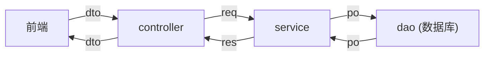
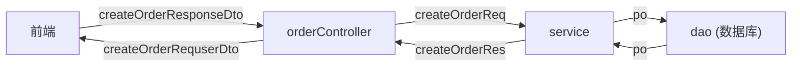

# 通用数据流规范图

```mermaid
%% 通用数据流规范图
flowchart LR
    F["前端"] 
    C["controller"]
    S["service"]
    D["dao (数据库)"]
    
    F -->|dto| C
    C -->|dto| F
    C -->|req| S
    S -->|po| D
    D -->|po| S
    S -->|res| C
```

# 建订单示例图（数据流规范举例）

```mermaid
%% 创建订单示例图
flowchart LR
    F2["前端"]
    C2["orderController"]
    S2["service"]
    D2["dao (数据库)"]
    
    F2 -->|createOrderResponseDto| C2
    C2 -->|createOrderRequserDto| F2
    C2 -->|createOrderReq| S2
    S2 -->|po| D2
    D2 -->|po| S2
    S2 -->|createOrderRes| C2
```
